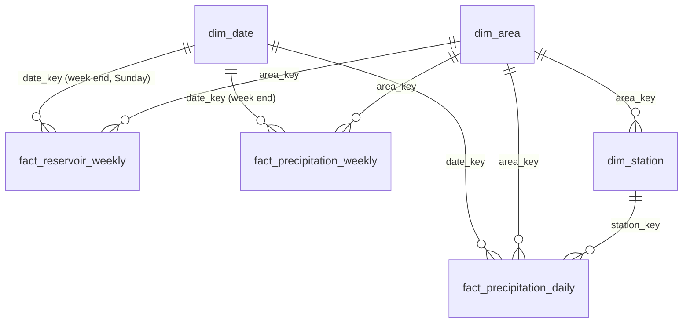

# DyrWatt – reservoir & precipitation data platform

Solution to the Fraktal *Data Engineer* case. DyrWatt AS wants to see reservoir
filling and precipitation side by side to plan hydropower production. Both come
from NVE's open APIs: Magasinstatistikk for reservoirs and seNorge
(GridTimeSeries) for daily precipitation. MET Frost is supported as an optional
extra source. This repo fetches the data, stores it in a database, models it as a
star schema **in SQL**, and serves it to Power BI and to an interactive HTML dashboard.

```
NVE Magasinstatistikk ─┐                 ┌─ raw.*  (1:1 with API)    00_raw.sql (+ 01_raw_frost*.sql)
NVE seNorge (GTS) ─────┼─ ingest.py ─► data/landing/*.json ─► DuckDB ─┤  stg.* (views: clean/type) 10_staging.sql
MET Frost (optional) ──┘   (Python: extract only)                 │  dw.*  (star schema)       20_dimensions.sql, 30_facts.sql
                                                                   └─ rpt.* (report views)      40_reports.sql
                                                                 │
                                         Power BI (DuckDB ODBC) ◄┤
                              export_dashboard.py ─► dashboard/dyrwatt_dashboard.html
```

## Quick start

```bash
pip install -r requirements.txt
python ingest.py                      # 1. extract  -> data/landing/   (no API keys needed)
python build.py                       # 2. transform -> data/dyrwatt.duckdb
python export_dashboard.py            # 3. serve    -> dashboard/dyrwatt_dashboard.html
```

Optional: set `FROST_CLIENT_ID` (free at https://frost.met.no/auth/requestCredentials.html)
and `ingest.py` also lands MET station data; `build.py` picks it up automatically.

Data coverage in the delivered build: reservoir filling 1995 – week 40 2026 (14,913 NVE rows),
precipitation 1 Jan 2018 – 6 Oct 2026 (set `START_YEAR` for a longer precipitation history).
The landing files are included in `data/landing/`, so `python build.py` works offline.

Offline testing: `python demo/generate_demo_data.py` writes placeholder reservoir files
in the exact NVE shape. The dashboard shows a banner while they are loaded, and
`python ingest.py --only nve` replaces them with the real series.

## Design decisions

| Decision | Why |
|---|---|
| **DuckDB** | Free, single file, no server, fast analytical SQL, reads JSON natively, ODBC driver for Power BI. Easy to move to Postgres/SQL Server later – the SQL is mostly ANSI. |
| **Python only extracts** | The case says transformations belong in SQL. Python lands untouched JSON; every rename, type cast, de-dup and join is in `sql/`. |
| **Landing zone of raw JSON** | Re-runnable and auditable: the model can be rebuilt from the files without calling the APIs again. |
| **Layers raw → stg → dw → rpt** | raw = audit copy, stg = clean views, dw = star schema tables, rpt = one view per business question. |
| **Precipitation from NVE seNorge, not only Frost** | seNorge is NVE's 1×1 km gridded daily precipitation (`rr`, since 1957), open with no key. A grid point can sit *at the reservoir*, in the mountains where inflow forms, instead of at a city weather station near the coast. |
| **One point per elspot area at a key reservoir** (`sql/seeds/precip_points.csv`) | Aurdal/Valdres (NO1, 381 m), Blåsjø/Ulla-Førre (NO2, 1090 m), Aursjøen/Aura (NO3, 856 m), Storglomvatnet/Svartisen (NO4, 400 m), Sysenvatnet/Sima (NO5, 1060 m). Add rows to use more points per area; the model averages them. |
| **Frost kept as an optional source** | The case names Frost, so the code supports it (`sum(precipitation_amount P1D)`, `timeoffsets=PT6H`). Frost stations are stored in the same star schema but only used for an area's totals when that area has no seNorge point (`dim_station.use_for_area`), so city stations and mountain catchments are never averaged together. |
| **Incremental precipitation load** | One file per point-year; closed years are skipped once landed, the current year is refreshed. Reservoir data is a small full refresh (NVE revises history). |
| **ISO weeks for year-over-year** | NVE publishes per ISO week (ending Sunday). Comparing week 39 to week 39 is like-for-like; calendar dates would drift. |

## Data model



- **dim_date** – every day; calendar *and* ISO attributes (`iso_year`, `iso_week`, `week_end_date`), Norwegian month names, season, hydrological year (starts 1 Oct). One conformed date dimension serves both the weekly and the daily fact.
- **dim_area** – NO1–NO5 plus `NOR` (national total) with NVE's descriptions.
- **dim_station** – precipitation points: seNorge grid points (with elevation from the API) and any Frost stations, with `source` and `use_for_area`.
- **fact_reservoir_weekly** (area × week) – fill %, TWh, capacity, weekly change, same week last year, NVE historic min/median/max for that week, deviation from median.
  `change_pp` is computed in SQL from consecutive weeks so it always matches the plotted line; NVE's own published change is kept as `nve_change_pp` in staging (they differ in ~65 of 14,900 weeks, mostly 2024 onwards, where NVE revised the previous week after publishing).
- **fact_precipitation_daily** (point × day) – mm, wet-day flag (≥ 1 mm), quality code (Frost only).
- **fact_precipitation_weekly** (area × week) – aggregate keyed on the same week-end date as the reservoir fact, so rain and fill compare directly.

## Reports – how each requirement is answered

| Requirement | View | Dashboard |
|---|---|---|
| Trends over time, fill & precipitation | `rpt.reservoir_trend`, `rpt.precipitation_monthly` | Season chart + aligned weekly rain strip; long-term trend |
| Max and min values | `rpt.yearly_summary`, `rpt.alltime_extremes` | Year table (max/min with week, wettest day) |
| Comparison with the previous year | `fill_pct_prev_year`, `yoy_*`, `precip_ytd_yoy_pct` | KPI tiles, dashed last-year lines, grouped month bars |
| Periods with the largest change | `rpt.largest_changes` (1-week & 4-week, fill & rain, ranked per year and all-time) | "Største endringer" with metric and period tabs |
| Visualisation proposal | see below | the dashboard itself |

Precipitation year-to-date is compared up to the same day of year, so the current
(incomplete) year is not compared against a full year. Partial months are flagged
(`is_partial_month`) and drawn hatched.

## Visualisation proposal

1. **KPI strip** – current fill, Δ vs same week last year, Δ vs historic median with a status chip (normal / under / far under), precipitation YTD vs last year. The four numbers a production planner needs on Monday morning.
2. **Season chart** – fill by ISO week: this year (solid), last year (dashed), NVE median (dotted) and min–max band. Reservoirs are seasonal, so "where are we vs a normal year at this point" beats a raw time series.
3. **Rain strip on the same week axis** directly below – shows which rain events moved the reservoir.
4. **Monthly precipitation** – grouped bars this year vs last year with a tick for the long-run monthly average.
5. **All areas vs median** – diverging bars; spots regional imbalance (e.g. a dry NO2) at a glance. Clicking selects the area.
6. **Long-term trend** – full history to show multi-year drift and extreme years.
7. **Tables** – yearly max/min/avg and a ranked list of the largest changes.

Avoided on purpose: dual-axis charts (fill % and mm on one chart) – the two series sit in aligned stacked charts instead.

## Power BI

1. Install the DuckDB ODBC driver (https://duckdb.org/docs/stable/clients/odbc/windows) and create a DSN pointing at `data/dyrwatt.duckdb` (read-only).
2. *Get data → ODBC*, pick the DSN, load `dw.*` (star schema) – or `rpt.*` for ready-made report tables.
3. Relationships: `dim_date[date_key]` 1→* each fact, `dim_area[area_key]` 1→* each fact, `dim_station[station_key]` 1→* `fact_precipitation_daily`. Single direction. Mark `dim_date` as date table.
4. Suggested measures:

```dax
Fill % = AVERAGE ( fact_reservoir_weekly[fill_pct] )
Fill % last year = AVERAGE ( fact_reservoir_weekly[fill_pct_prev_year] )
Fill Δ vs LY (pp) = [Fill %] - [Fill % last year]
Fill Δ vs median (pp) = [Fill %] - AVERAGE ( fact_reservoir_weekly[hist_median_pct] )
Precipitation (mm) = SUM ( fact_precipitation_daily[precip_mm] )
Precipitation LY (mm) = CALCULATE ( [Precipitation (mm)], SAMEPERIODLASTYEAR ( dim_date[date] ) )
Wet days = SUM ( fact_precipitation_daily[is_wet_day] )
```
Previous-year fill is precomputed in SQL on ISO week (DAX time intelligence works on calendar dates and would misalign weeks).

Alternative per the case: MySQL on freesqldatabase.com. The SQL would need minor dialect changes (`QUALIFY`, `ARG_MAX`, `generate_series`) – DuckDB was chosen to keep it simple and free of size limits.

## Next steps

- Schedule `ingest → build → export` daily (Task Scheduler / cron / GitHub Actions); NVE publishes Wednesdays 13:00.
- Data tests (row counts, no duplicate keys, fill between 0–100 %, gaps in station series).
- Precipitation averaged over whole catchment polygons instead of one point per area, and snow water equivalent (seNorge `swe`) plus `qtt` (rain + snowmelt), which drive spring inflow more than rain alone. Both are in the same GridTimeSeries API.
- Inflow / production data from DyrWatt's own systems as a third fact on the same dimensions.

## Files

```
config.py                 settings (areas, stations, years, API base URLs)
ingest.py                 extract NVE reservoirs + seNorge precipitation (+ optional Frost) -> data/landing/
build.py                  run sql/ in order against data/dyrwatt.duckdb
export_dashboard.py       rpt.* -> self-contained HTML dashboard
sql/00_raw.sql … 40_reports.sql, sql/01_raw_frost*.sql (optional source)
sql/seeds/precip_points.csv, sql/seeds/station_area.csv
dashboard/template.html   dashboard source (data injected by export)
demo/generate_demo_data.py placeholder reservoir data in NVE format, for offline testing
```
